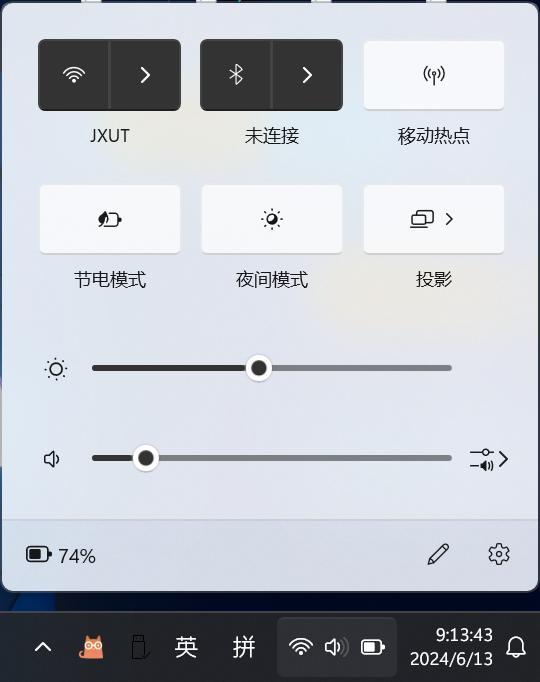

## 使用场景

Windows 并不会去根据任务栏背景色吊改变字体颜色，当使用例如 [TranslucentTB](https://github.com/TranslucentTB/TranslucentTB)，在一些背景下，导致任务栏暗色时，默认字体显示仍为黑色，导致观察困难，可读性差。所以可以通过修改注册表改变任务栏默认字体颜色。



## 修改注册表

新建一个.txt 文件，打开记事本，复制以下内容，粘贴到记事本中，保存为.reg 文件，双击打开，即可修改注册表。

```text
Windows Registry Editor Version 5.00

[HKEY_CURRENT_USER\Software\Microsoft\Windows\CurrentVersion\Themes\Personalize]
"ColorPrevalence"=dword:00000002
```

修改完成后，需要在任务管理器中，重启资源管理器，即可生效。若仍然无效可以尝试重启。

## 回归默认设置

类似之前的方法，将 `ColorPrevalence` 的值设置为 `0`，再双击打开.reg 文件修改。

```text
Windows Registry Editor Version 5.00

[HKEY_CURRENT_USER\Software\Microsoft\Windows\CurrentVersion\Themes\Personalize]
"ColorPrevalence"=dword:00000000
```
