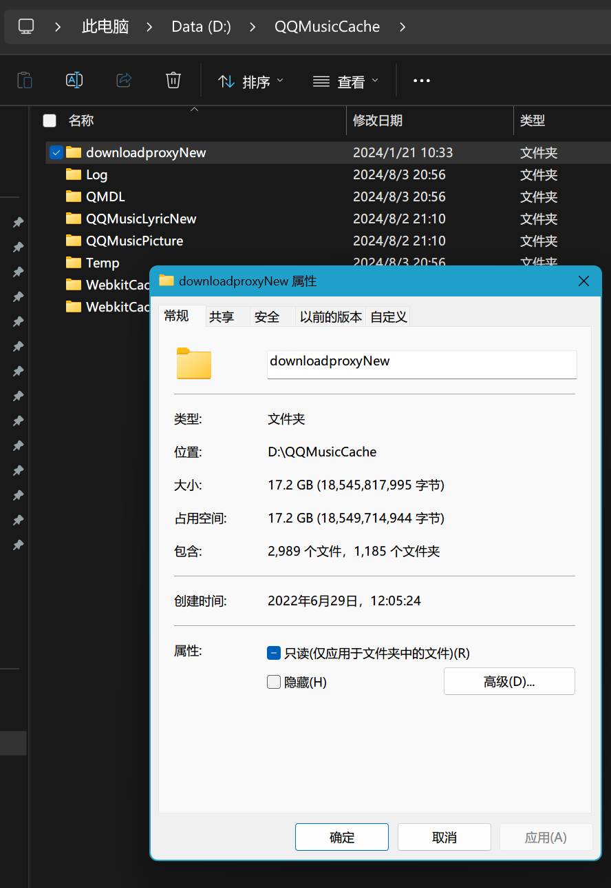

## 引

最近 C 盘有点告急,刚好整理一下电脑上的文件, 通过 [SpaceSniffer](https://github.com/redtrillix/SpaceSniffer/releases) 可以以图形大小的形式查看和反映磁盘上各文件的大小,发现 QQ 音乐缓存文件占了很大的一块,起初还以为只是平常的听歌缓存,后仔细翻看文件夹,观察文件夹命名发现是 QQ 音乐 P2P 下载的缓存,占用高达 `17GB`🥲所以就禁用了 QQ 音乐 P2P 下载.

  

## 教程

附上教程

>[禁止QQ音乐后台上传教程](https://www.bilibili.com/read/cv27616306/)

刚好前两天看到一期视频讲到了 P2P

>[【X.PIN】偷你流量还断你家网，视频平台和运营商打架，把消费者干成了小丑。。。](https://www.bilibili.com/video/BV18x4y1476o)
