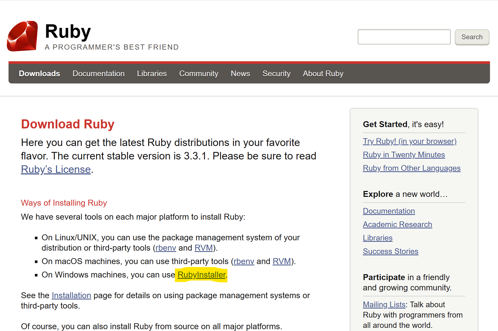
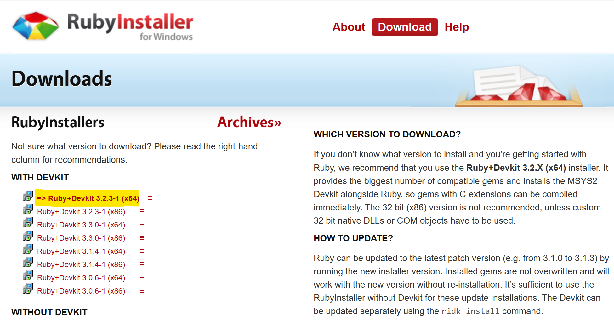
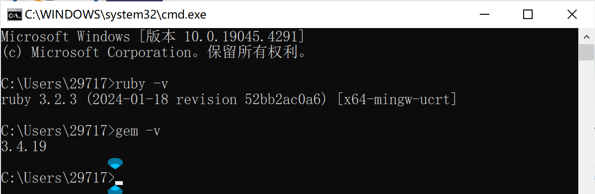
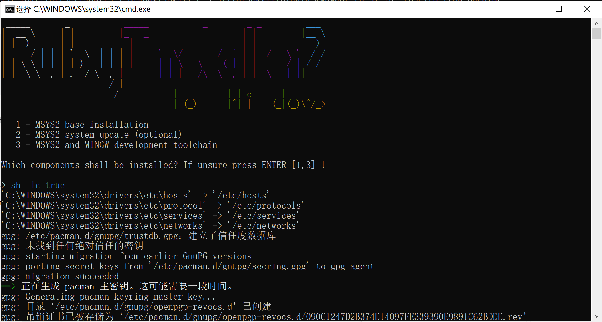
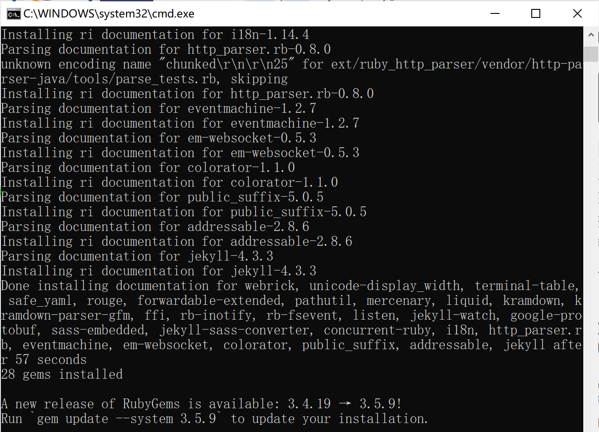
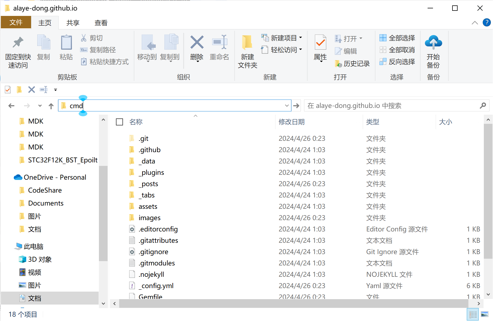
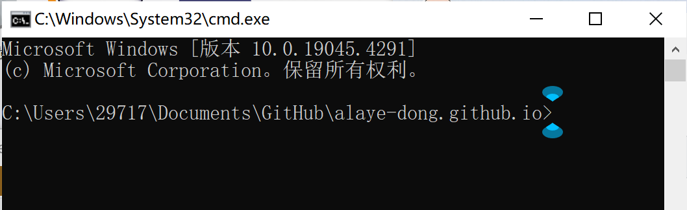
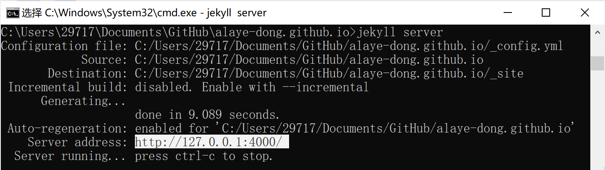
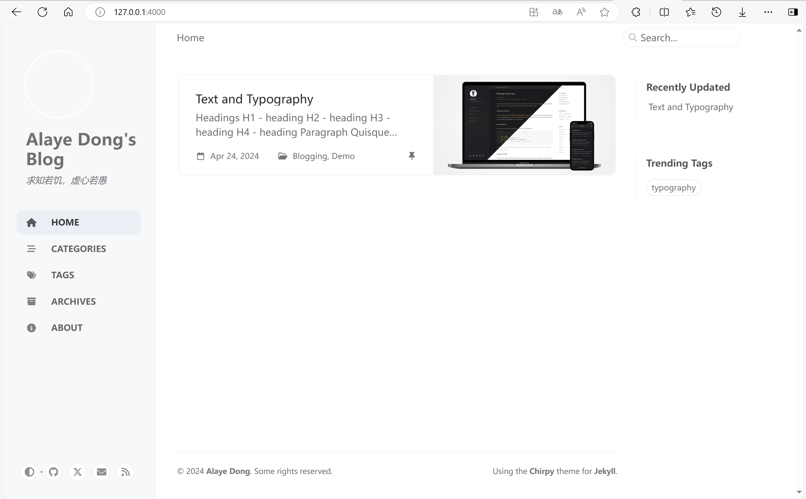

## 为什么选Jeklly

> Jeklly 的一个最好的特点是『关注 blog 本身』。这是指什么呢？简单的说就是写博客的过程被铸造进了 Jekyll 的功能中。你只需简单的管理你电脑中的一个文件夹下的文本文件就可以写文章并方便的在线上发布。与繁琐的配置和维护数据库和基于网站的内容管理系统 (CMS) 相比，这是一个非常受欢迎的改变。

---

## 安装 Jekyll

### 事先准备

> - [Ruby](https://www.ruby-lang.org/en/downloads/)（including development headers, Jekyll 2 需要 v1.9.3 及以上版本，Jekyll 3 需要 v2 及以上版本）
> - [RubyGems](https://rubygems.org/pages/download)
> - Linux, Un ix, or Mac OS X
> - [NodeJS](https://nodejs.org/), 或其他 JavaScript 运行环境（Jekyll 2 或更早版本需要 CoffeeScript 支持）。
> - [Python 2.7](https://www.python.org/downloads/)（Jekyll 2 或更早版本）

官方文档没有说 Windows，不过 Windows 设备也可以安装。并且一般情况我们都是安装 Jekyll3 及以上的版本，所以我们需要准备的可以是这些：

- [Ruby](https://www.ruby-lang.org/en/downloads/)
- [RubyGems](https://rubygems.org/pages/download)
- Windows，Linux, Unix, Mac OS X 系统中的其中一种（以下教程都以 Windows 为例）
- [NodeJS](https://nodejs.org/)

#### 安装 Ruby、RubyGems

进入 [Ruby](https://www.ruby-lang.org/en/downloads/) 官网，选择对应的安装方式，Windows 设备选 `RubyInstaller`，并下载安装。



`Ruby+Devkit` 中包含了 `Ruby` 和 `RubyGems`，下载并安装 `Ruby+Devkit`。



命令行中分别输入 `ruby -v` 和 `gem -v` 查看版本，确认安装完成。



安装完成后，会自动弹出 `cmd.exe`。如下图所示， 提示安装 `MSYS2`，它是用来编译 `Ruby` 本地包的，我们需要手动输入 `[1,2,3]`，然后回车进行安装。由于网络的原因，可能会安装极慢，甚至安装失败，但是这是必须的步骤，只能多试几次，或者“爬高一点”。这里如果没有弹出命令行 `MSYS2` 安装界面或者把它关掉了，那么可以重新打开 `cmd` 命令行，输入 `ridk install` 来再次进入 MSYS2 安装界面。



#### 安装 NodeJS

进入 [NodeJS](https://nodejs.org/) 官网，点击 Download 即可然后安装即可，没有什么特别的需要注意的地方，略过。

### 正式安装

使用 gem 安装 Jekyll：

```ruby
gem install jekyll
```

这样就把 jekyll 安装完成了。



## 本地 Server

### 项目文件夹启动命令行

相关命令只能在一个含有 `Gemfile` 的目录下执行，如项目的根目录。在项目所在的文件夹进入 `cmd`。在项目文件夹文件管理器地址栏输入 `cmd` 并回车。



命令行显示的项目文件夹的地址即可。



### 安装 bundle

Rails 3 中引入 Bundle 来管理项目中所有 gem 依赖，所以首先我们需要安装 bundle。

### 安装 webrick 模块

webrick 是 Ruby 的 web 服务器模块，从 Ruby 3.0 开始 webrick 已经不再绑定到 Ruby 中了，请参考链接： [Ruby 3.0.0 Released](https://link.zhihu.com/?target=https%3A//www.ruby-lang.org/en/news/2020/12/25/ruby-3-0-0-released/) 中的说明，webrick 需要手动进行添加。

添加的命令为：

```
bundle add webrick
```

手动进行添加 `webrick`：

```
bundle add webrick
```

### 启动 server

启动本地 server：

```
jekyll server
```

将地址复制粘贴到浏览器，访问生成的本地地址：



成功，大功告成~



### 配置启动命令文件

为了方便启动`jekyll server`和调试，可以编写一个命令执行文件，之后可以直接双击运行。

```powershell
start http://127.0.0.1:4000/
jekyll serve --livereload
```

> `start http://127.0.0.1:4000/` 启动浏览器并打开本地网址
> 
> `--livereload` 在源文件更新后自动刷新本地预览网页
{: .prompt-tip }

---

参考引用：

[https://jekyllcn.com/docs/home/](https://jekyllcn.com/docs/home/)

[https://zhuanlan.zhihu.com/p/139567128](https://zhuanlan.zhihu.com/p/139567128)

[https://zhuanlan.zhihu.com/p/426510048](https://zhuanlan.zhihu.com/p/426510048)

[https://dovesandy.github.io/2020/03/12/jekyll-start-jekyll-error/](https://dovesandy.github.io/2020/03/12/jekyll-start-jekyll-error/)
