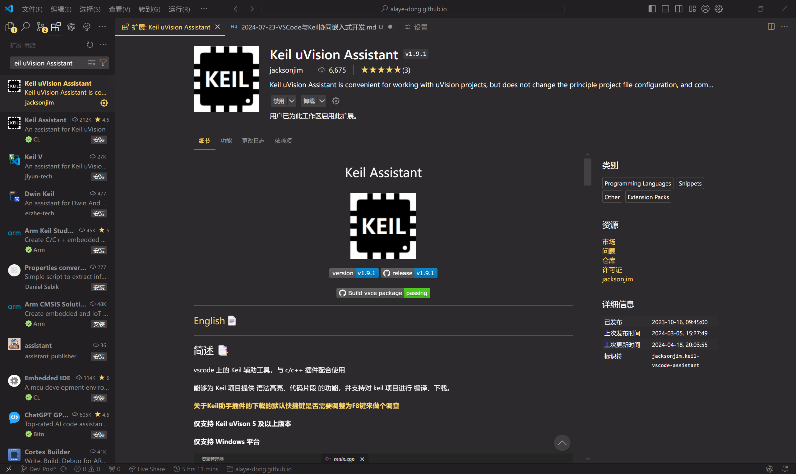

## 引言

*Keil*是嵌入式开发中常用的 IDE，但是*Keil*没有方便的自动补全、代码重构、自由度高的插件等功能，代码的编辑体验很难比拟*VSCode*的现代化。通过*VSCode*中插件的能力，可以使*VSCode*调用*Keil*的编译器进行编译，并直接在*VSCode*的内置控制台中显示报错信息和错误代码行跳转，实现一站式编辑&编译是替代方案，提高了嵌入式开发效率。

## 先前条件

* 已经安装了*VSCode*和*Keil*
* 已经配置好*Keil*的 `License`
* 可以使用 Keil 直接进行代码编辑和编译

*VSCode*和*Keil*的安装与基础配置，网络上已经有很多教程，可自行搜索，这里不再赘述。

> *VSCode*：[下载地址](https://code.visualstudio.com/download)
> 
> *Keil*：[下载地址](https://www.keil.com/download/product/)
{: .prompt-tip }

## 安装和配置*Keil uVision Assistant*

打开*VSCode*，点击 `扩展` 图标，搜索 `Keil uVision Assistant`，安装该插件并启用。



> 这里搜索结果可能会出现两个名字类似的插件，这里做出解释：*Keil Assistant* 已于 *Jun 13, 2021* 归档转为只读。*Keil uVision Assistant* 是 *Keil Assistant* 的后续版本，由另外一个开发者 *jacksonjim* 负责继续更新及维护。 
{: .prompt-info }

点击插件右侧的 `⚙️`-`拓展设置` 根据所开发的单片机芯片的架构和*Keil*的安装目录，完成插件的基础配置。


`键` 为单片机芯片的架构，`值` 为*Keil*的安装目录。如果忘记了*Keil*的安装目录，可以在桌面右键 `Keil uVision-快捷方式`，然后 `打开文件所在的位置`，再从当前的文件夹位置往上回退一级，定位到包含 `UV4.exe` 所在的的 `UV4` 文件夹即可。如图情况所示，对应的 `值` 为 `C:\Keil_v5`。


## 开始使用

使用*VSCode*打开一个项目文件夹，就可以在*VSCode*中直接进行代码编辑和编译了。*Keil uVision Assistant*的 `README.md` 中有详细的使用教程，可以参考。

>[Keil Assistant README.md](https://github.com/jacksonjim/keil-assistant/blob/master/README.md)

## 补充

### 自动 Open Project

使用 *Keil uVision Assistant* 插件进行开发，如果 `.uvprj` 文件不在项目的一级子文件夹中，插件将无法自动识别到 `.uvprj` 文件，每次打开*VSCode*写项目代码时都需要手动指定 `.uvprj` 文件地址，进行重复的 `Open Project` 的操作，不够*优雅*。

其实*Keil uVision Assistant* 插件中有一项 `File Location List` 设置，可以添加 `.uvprj` 文件所在的文件夹路径，这样每次打开项目文件夹时插件就会自动识别到 `.uvprj` 文件，搭配*VSCode*的 `workspace` 功能，体验更佳。

  

### 添加/删除项目源文件

利用*Keil uVision Assistant*插件在*VSCode*中进行代码编译，原理是通过调用*Keil*的编译器实现的，所以***Keil* 的安装是必须的**。并且给项目添加/删除的源文件也必须回到*Keil*, 

  

## 注意

### 编码格式及中文注释乱码

*Keil*原因，使用中文注释必须使用 `GB2312` 编码，所以为了避免出现注释乱码同时保持*Keil*编辑的可读兼容性。可以在*VSCode*中进行对应的设置。

打开*VSCode*设置，搜索 `encoding`，勾选 `Auto Guess Encoding`，在 `Candidate Guess Encoding` 中依次添加 `gb2312`、`utf8`。

  

### C51/C251 的中断提示问题

使用 `Keil uVision Assistant` 插件进行开发，但是 C51/C251 项目中 `中断函数` 的 `interrupt x`（x 代表中断号即一个数字）会导致*VSCode*语法分析报错，这是因为*VSCode*的语法分析是基于标准 C 语言的，标准 C 语言中没有 `中断函数` 的 `interrupt x` 的语法。

所以需要在代码头文件通过宏定义进行修复，具体请参照 [关于 C51/C251 的中断提示问题](https://github.com/jacksonjim/keil-assistant/blob/master/README.md)。将所有 `interrupt x` 改为 `INTERRUPT(x)` 并在头文件中加入对应芯片架构的替换修复的宏定义。

>如果项目涉及到日后的他人维护，为避免产生不必要的不解或错误，注意在代码中对于解决本问题做出的修改**进行必要的注释**。
{: .prompt-warning }

#### 中断函数修改

**一般**的中断函数：
```c
void TM0_Isr() interrupt 1
{
}
```
**修改后**的中断函数：
```c
void TM0_Isr() INTERRUPT(1)
{
}
```

#### 头文件修改

在头文件中加入对应芯片架构的替换修复的宏定义：

对于**C51**：

```c
#ifndef __VSCODE_C51__
#define INTERRUPT(x) interrupt x
#else
#define INTERRUPT(x)
#endif
```

对于**C251**：

```c
#ifndef __VSCODE_C251__
#define INTERRUPT(x) interrupt x
#else
#define INTERRUPT(x)
#endif
```

---

END