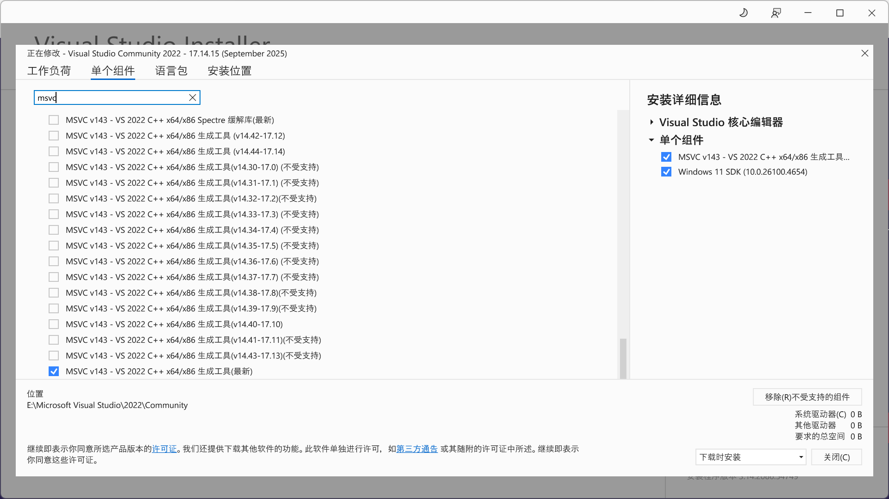

## MSVC & Windows SDK

在正式开始安装 Rust 之前需要确保已经安装了 C++ 桌面开发环境。建议可以在启动 Rustup 之前，手动下载 Visual Studio Installer，并可直接到单个组件页面搜索并勾选必要的 MSVC 和 Windows SDK，达到最小化安装体积的效果。并在语言包中勾选英文（建议必选）和其他需要的语言，如中文。同时记得在安装位置选择卡中，根据个人情况调整安装位置到非 C 盘，来减少 C 盘占用空间。



## 配置镜像

访问 [RsProxy](https://rsproxy.cn/)，根据提示信息，编辑系统环境变量，设置 Rustup 镜像，加快接下来安装 Rust 下载默认包的速度。

```powershell
setx RUSTUP_DIST_SERVER "https://rsproxy.cn"
setx RUSTUP_UPDATE_ROOT "https://rsproxy.cn/rustup"
```

## 配置 Rust 安装位置

>[!IMPORTANT]
>提前设置环境变量进行变更存储位置，否则后续所有依赖库都默认存放到 C 盘。

手动创建一个文件夹，如 `rust`。并在其中创建 `.rustup` 和 `.cargo` 两个子文件夹。编辑系统环境变量，将对应的路径填入其中。

```powershell
setx RUSTUP_HOME "D:\DevEnv\rust\.rustup"
setx CARGO_HOME "D:\DevEnv\rust\.cargo"
```

## 正式安装 Rust

访问 [入门 - Rust 程序设计语言](https://www.rust-lang.org/zh-CN/learn/get-started)，下载 Rustup，运行安装程序，查看提示信息，配置不出错的话，默认回车即可。

安装完成后新建终端，使用 `rustc --version` 验证安装。

```powershell
PS C:\Users\Alaye> rustc --version
rustc 1.89.0 (29483883e 2025-08-04)
```

## 🦀 Hello Rust！

阅读 [Rust in Visual Studio Code](https://code.visualstudio.com/docs/languages/rust#_hello-world)，在 VSCode 中安装 `rust-analyzer` 插件。

创建存放项目的文件夹并新建项目，依次运行命令。

```powershell
cargo new hello_world

cd hello_world
code .

cargo run
```

查看运行结果！

```powershell
PS D:\Alaye\CODE\rust-study\hello_world> cargo build
   Compiling hello_world v0.1.0 (D:\Alaye\CODE\rust-study\hello_world)
    Finished `dev` profile [unoptimized + debuginfo] target(s) in 2.36s
PS D:\Alaye\CODE\rust-study\hello_world> cargo run  
    Finished `dev` profile [unoptimized + debuginfo] target(s) in 0.06s
     Running `target\debug\hello_world.exe`
Hello, world!
```

推荐阅读 [简介 - Rust 程序设计语言 中文版](https://www.rustwiki.org.cn/zh-CN/book/ch00-00-introduction.html)，开启🦀 Rust 的学习之旅~

## 参考

- [Rust，msvc工具链最小安装，VisualStudio Installer里怎么选 - 知乎](https://zhuanlan.zhihu.com/p/678846997)
- [【rust】《 安装Rust（更改默认安装路径）并配置cargo国内源（提供rust包查询网站） 》 - 芋白 - 博客园](https://www.cnblogs.com/-CO-/p/18041169)
- [设置国内镜像代理RsProxy](https://rsproxy.cn/#FAQ)
- [在windows上安装rust开发环境_哔哩哔哩_bilibili](https://www.bilibili.com/video/BV1rP1YYEEr3/?spm_id_from=333.337.search-card.all.click&vd_source=0bc57f10d8dee0404528f4fe02be80ff)
-  [Rust in Visual Studio Code](https://code.visualstudio.com/docs/languages/rust#_hello-world)