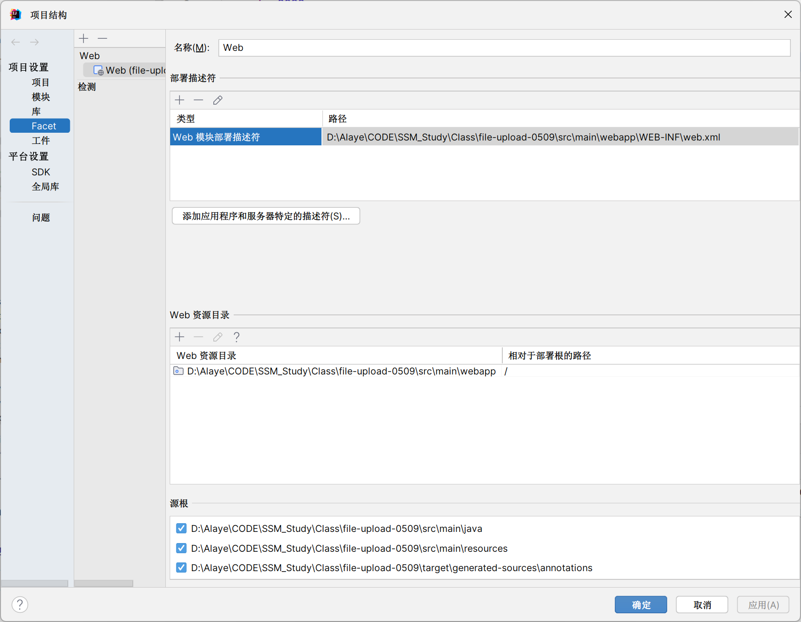

在现代 Web 开发中，虽然前后端分离的开发方式或者 Thymeleaf、Freemarker 等模板引擎更为流行，但在某些传统项目或特殊环境（如部分企业、~~我大学的 SSM 课程作业~~）中，JSP（Java Server Pages） 仍有一定的使用场景。本文将详细介绍如何在一个 Spring Boot 项目中配置并使用 JSP。

## 创建 Spring Boot 项目

你可以通过 [Spring Initializr](https://start.spring.io/) 创建一个基础的 Spring Boot 项目，选择以下依赖项：

- Spring Web
- 或者手动添加相关依赖

创建完成后，导入 IDE（如 IntelliJ IDEA 或 Eclipse）进行后续开发。

> [!TIP]
> IDEA 中集成了 Spring Initializr，新建项目时可以直接使用 Spring Initializr

## 引入 JSP 相关依赖

由于 Spring Boot 默认不支持 JSP，我们需要手动引入相关依赖。编辑 `pom.xml` 文件，添加以下内容：

```xml
<!-- 引入内嵌 Tomcat 对 JSP 的支持 -->
<dependency>
    <groupId>org.apache.tomcat.embed</groupId>
    <artifactId>tomcat-embed-jasper</artifactId>
</dependency>

<!-- JSTL 标签库支持 -->
<dependency>
    <groupId>javax.servlet</groupId>
    <artifactId>jstl</artifactId>
    <version>1.2</version>
</dependency>
```

如果对应的 Tomcat 版本为 10 及以上，则添加：

```xml
<!-- JSTL 标签库支持 -->
<dependency>  
    <groupId>org.glassfish.web</groupId>  
    <artifactId>jakarta.servlet.jsp.jstl</artifactId>  
    <version>2.0.0</version>  
</dependency>
```

> [!INFO]
> [查看和指定SpringBoot内嵌Tomcat的版本 - 牧之丨 - 博客园](https://www.cnblogs.com/exmyth/p/15479357.html)

## 配置 Web 资源目录与结构

Spring Boot 默认使用 `resources/templates` 来存放模板文件，但 JSP 必须放在 `webapp/WEB-INF/jsp/` 目录下。你需要手动创建该目录结构，推荐 `webapp/WEB-INF/jsp/`。

### 推荐目录结构如下：

```
src/
└── main/
    ├── java/
    │   └── com.example.demo/
    │       └── DemoApplication.java
    └── webapp/
        └── WEB-INF/
            └── jsp/
                ├── hello.jsp
                └── success.jsp
```

### IDEA 设置项目结构

在 IDEA 顶部导航栏，选择 `文件 - 项目结构 - 项目设置 - Facet` 

配置 Web 资源目录 `项目路径\src\main\webapp`

添加部署描述符 web.xml , 路径 `项目路径\src\main\webapp\WEB-INF\web.xml`



## 配置视图解析器（application.yml）

在 `application.yml` 中配置 JSP 页面的前缀和后缀路径：

```yaml
spring:
  mvc:
    view:
      prefix: /WEB-INF/jsp/
      suffix: .jsp
```

这样配置后，控制器返回的字符串会自动拼接为对应的 JSP 路径。

例如：

```java
return "hello"; // 将映射到 /WEB-INF/jsp/hello.jsp
```

## 编写 Controller 示例

接下来我们写一个简单的控制器来测试 JSP 页面是否正常渲染。

```java
package com.example.demo.controller;

import org.springframework.stereotype.Controller;
import org.springframework.ui.Model;
import org.springframework.web.bind.annotation.GetMapping;

@Controller
public class JspController {

    @GetMapping("/hello")
    public String sayHello(Model model) {
        model.addAttribute("message", "Hello from Spring Boot with JSP!");
        return "hello";
    }
}
```

## 创建 JSP 页面

在 `src/main/webapp/WEB-INF/jsp/` 下创建 `hello.jsp` 文件：

```jsp
<%@ page contentType="text/html;charset=UTF-8" language="java" %>
<html>
<head>
    <title>Hello JSP</title>
</head>
<body>
    <h1>${message}</h1>
</body>
</html>
```

启动项目访问：[http://localhost:8080/hello](http://localhost:8080/hello)，你应该能看到页面成功展示消息。

## 总结

通过以上步骤，我们完成了在 Spring Boot 项目中集成 JSP 的全过程。