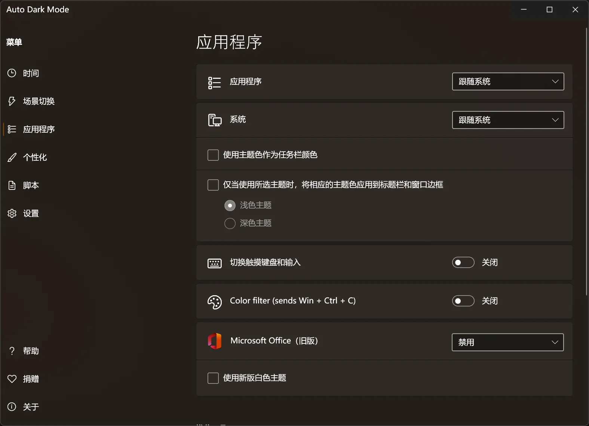
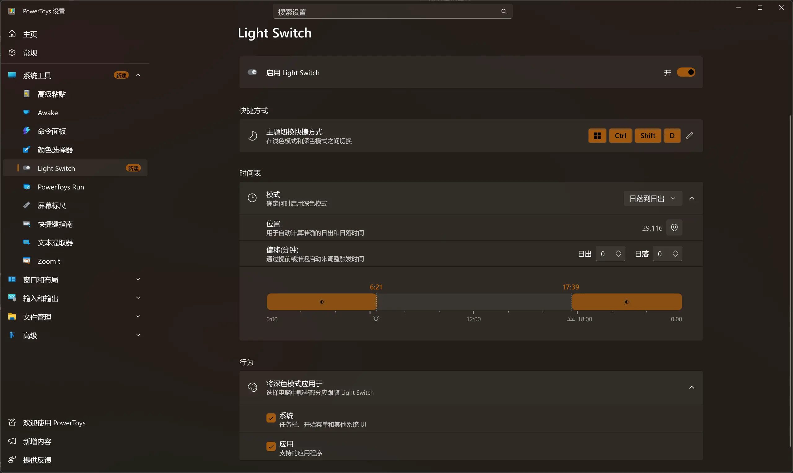

## Windows 自动切换夜间模式

## 引

在 Windows 中，系统原生并不支持根据时间自动切换深色/浅色主题。然而习惯了手机等设备近年来普及的自动夜间模式，对比 WIndows 会没有统一的体验，并且长时间面对过亮可能影响视觉舒适度与工作效率。这里介绍几种实现 Windows 自动切换夜间模式的工具。

### AutoDarkMode

[AutoDarkMode/Windows-Auto-Night-Mode: Automatically switches between the dark and light theme of Windows 10 and Windows 11](https://github.com/AutoDarkMode/Windows-Auto-Night-Mode)

AutoDarkMode 还附带有更多的相关自定义设置，且轻量化。安装完大约占用 200MB 存储。

### PowerToys - Light Switch 

[microsoft/PowerToys: Microsoft PowerToys is a collection of utilities that help you customize Windows and streamline everyday tasks](https://github.com/microsoft/PowerToys)

PowerToys 是微软官方推出的面向高级用户的 Windows 效率增强工具集，其中 Light Switch 模块提供了基础的自动主题切换功能。由于 PowerToys 还附带其他实用工具，整体比较大，安装完大约占用 850MB 存储，远大于 AutoDarkMode。

## 总结

如果你只想要一个简单、智能、低开销的自动夜间模式切换器，AutoDarkMode 是更优选择。

而如果你已经是 PowerToys 用户，或希望在一个工具中管理多种 Windows 增强功能，那么使用其内置的 Light Switch 模块也足够满足基础需求。
