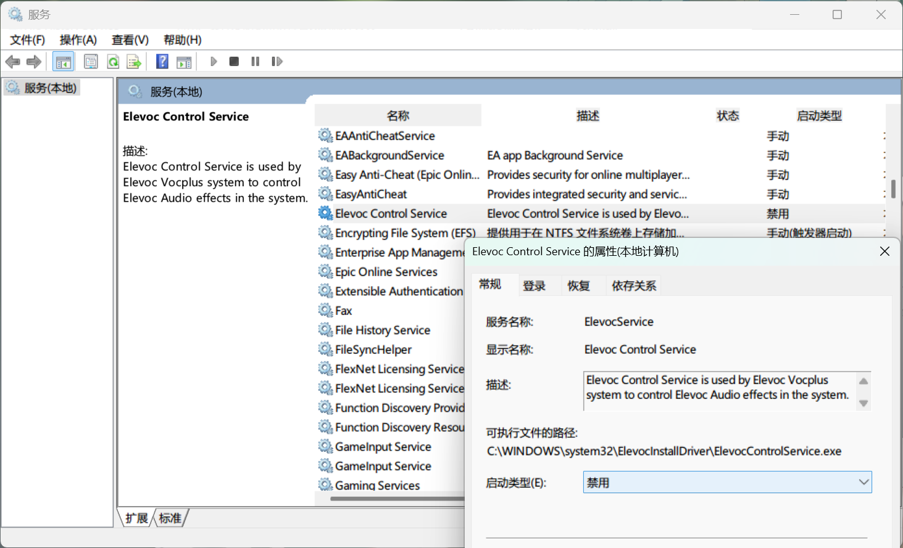

最近发现笔记本扬声器音质变得很奇怪，声音低哑，听起来就像在打蓝牙电话。排查了一下，原来是 `Elevoc Audio Effects Component` 惹的祸。

## 快速解决方法

1. 打开 `设备管理器`。
2. 找到 `音频处理对象(APO)`。
3. 找到 `Elevoc Audio Effects Component`，右键选择禁用或者直接卸载。

## 它到底是什么？

这个组件是 Elevoc 推出的音频增强工具，通常是通过 Windows 更新安装的，号称可以优化音质、降噪。但有时候它会和系统的音频配置发生冲突，结果反而让声音变得很糟糕。

## 如果卸载后又回来了怎么办？

Windows 更新可能会再次安装这个组件，所以光卸载可能不够用。这时可以选择以下方法：

1. **禁用组件** 直接禁用 `Elevoc Audio Effects Component` 就好。操作步骤和卸载一样，右键点击后选择“禁用”。禁用后，系统就不会加载它了。
    
2. **阻止它的更新** 用微软的 " 显示或隐藏更新工具 "（Show or Hide Updates Tool）来屏蔽相关更新。
    
    - 这个工具可以在微软官网找到。
    - 下载后运行，选择“隐藏更新”，然后把和 `Elevoc` 相关的更新屏蔽掉。
3. **回滚驱动版本** 如果你觉得还是不对劲，可以试着回滚到之前的音频驱动。
    
    - 在 `设备管理器` 里找到你的音频设备，右键属性。
    - 点击“驱动程序”选项卡，选择“回滚驱动程序”。

## ~~最后~~

虽然 `Elevoc Audio Effects Component` 本意是提升音质，但如果遇到不兼容的问题，最简单的办法就是禁用或卸载它。如果不想它再捣乱，禁用和屏蔽更新是目前最有效的办法。

## 疑惑

在禁用 `Elevoc Audio Effects Component` 之后，外放暂时就正常了，但重启电脑之后，还是会复现扬声器音质异常低哑的问题，~~这时再 `启用`，外放就又正常了。所以目前的解决方式就是 `禁用`/`启用` ，还是没有找到具体的原因和优雅的解决方法，待研究。~~

## 续

在网络中搜索了一下，发现类似的问题是因为使用了联想的会议扬声器降噪功能，但是奇怪的一点是我并没有在电脑上启用类似的功能也没有类似的开关。尝试直接禁用服务，在Windows服务中搜索`Elevoc Control Service`，选择右键属性，在`启动类型`中选择`禁用`，**解决！** 

